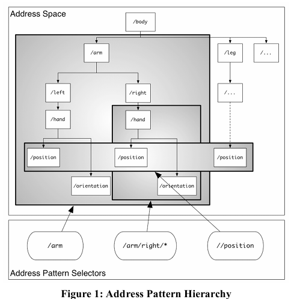

OSC Message Dispatching and Pattern Matching
=====================

When an OSC server receives an OSC Message, it must invoke the appropriate OSC Methods in its OSC Address Space based on the OSC Message’s OSC Address Pattern. This process is called dispatching the OSC Message to the OSC Methods that match its OSC Address Pattern. All the matching OSC Methods are invoked with the same argument data, namely, the OSC Arguments in the OSC Message.

The parts of an OSC Address or an OSC Address Pattern are the substrings between adjacent pairs of forward slash characters and the substring after the last forward slash character. (examples)

A received OSC Message must be disptched to every OSC method in the current OSC Address Space whose OSC Address matches the OSC Message’s OSC Address Pattern. An OSC Address Pattern matches an OSC Address if

The OSC Address and the OSC Address Pattern contain the same number of parts; and
Each part of the OSC Address Pattern matches the corresponding part of the OSC Address.
A part of an OSC Address Pattern matches a part of an OSC Address if every consecutive character in the OSC Address Pattern matches the next consecutive substring of the OSC Address and every character in the OSC Address is matched by something in the OSC Address Pattern. These are the matching rules for characters in the OSC Address Pattern:

* ‘?’ in the OSC Address Pattern matches any single character
* ‘*’ in the OSC Address Pattern matches any sequence of zero or more characters
* A string of characters in square brackets (e.g., “[string]”) in the OSC Address Pattern matches any character in the string. Inside square brackets, the minus sign (-) and exclamation point (!) have special meanings:
two characters separated by a minus sign indicate the range of characters between the given two in ASCII collating sequence. (A minus sign at the end of the string has no special meaning.)
* An exclamation point at the beginning of a bracketed string negates the sense of the list, meaning that the list matches any character not in the list. (An exclamation point anywhere besides the first character after the open bracket has no special meaning.)
* A comma-separated list of strings enclosed in curly braces (e.g., “{foo,bar}”) in the OSC Address Pattern matches any of the strings in the list.
* Any other character in an OSC Address Pattern can match only the same character.
* Multi-path wildcard matching from OSC 1.1 is available such that // will match the entire hierarchy.

OSC 1.1 XPath matching
======================
OSC 1.1 inherits the path multiple-level wildcard
matching operator ‘//’ from XPath. This overcomes 
the limitation of the OSC 1.0 ‘*’ operator that only 
matches up to ‘/’ boundaries. It also gives concrete 
semantics to the string ‘//’ in an address—which was 
previously not explicitly forbidden but may have resulted 
in inconsistent address handling due to ambiguity (e.g., in 
UNIX style path operations ‘//’ is a no-op equivalent to 
‘/’).  
The ‘//’ operator enables matching across disparate 
branches of the address tree and at any depth as illustrated 
in Figure 1. 

