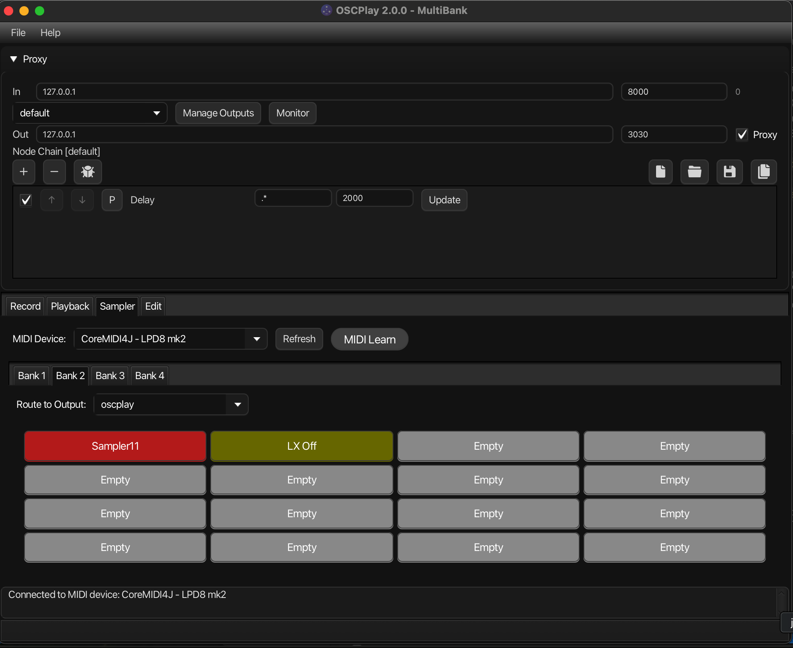

# OSCPlay

**Record and replay OSC automation without the source application.**

OSCPlay is a Java-based OSC (Open Sound Control) proxy server that captures, records, and replays OSC messages. Perfect for installations where you need to recreate Ableton Live, TouchOSC, or other OSC-based automation without the original software.




## Features

- **OSC Proxy Server**: Captures OSC messages in real-time and forwards them to destinations
- **Multiple Outputs**: Fan out messages to multiple destinations simultaneously
- **Session Recording**: Save OSC automation as JSON sessions with precise timing, optionally filtered to one address pattern so only the device you care about is captured
- **Session Playback**: Replay recorded sessions without the original OSC source
  - Synchronized audio playback support - play audio files alongside OSC automation
- **Manual Editing**: Edit recorded OSC messages directly through the UI
- **Sampler Banks**: Built-in pad interface for triggering session recordings
  - MIDI integration - trigger sampler pads via MIDI input
  - OSC triggering - trigger pads remotely via OSC messages
- **Message Processing**: Chain configurable nodes to modify OSC messages:
  - Rename addresses with regex patterns
  - Apply moving averages for smoothing
  - Filter/drop messages by pattern
  - Runtime JavaScript processing for custom transformations
  - And more...
- **Cross-Platform**: Runs on Windows and macOS

## Quick Start

### Download

Download the latest installer for your platform from the [Releases](../../releases/latest) page:

- **Windows**: `OSCPlay-<version>.exe`. Run the installer, which lets you choose an install folder and adds Start Menu and desktop shortcuts. The installer is unsigned, so Windows SmartScreen may warn you; click **More info** → **Run anyway**.
- **macOS**: `OSCPlay-<version>.dmg`. Open the disk image and drag OSCPlay into Applications.

Both installers bundle their own Java runtime, so no separate Java install is needed.

### Running
Running from the command line supports a --project MyProject argument that will bypass
the project selection splash screen for unattended and auto-starting installations.

### Agent control (MCP)
OSCPlay can run an MCP server so AI agents (Claude Code, etc.) can inspect and edit outputs
and node chains while it runs. It runs by default on `127.0.0.1:7770`; `--no-mcp` turns it off. See
[docs/MCP.md](docs/MCP.md).


## How It Works

1. **Setup**: Point your OSC controller (e.g., TouchOSC) to OSCPlay's proxy server
2. **Record**: OSCPlay forwards messages to your destination (e.g., Ableton) while recording
3. **Save**: Save the recorded session as a JSON file in your project
4. **Replay**: Play back the session on any computer without the original OSC source

OSCPlay stores projects in `~/Documents/OSCPlay/Projects/` with recordings, node configurations, and processing scripts organized per-project.

## Building from Source

Requires Java 17 and Maven:

```bash
mvn clean package
java -jar target/osc-play-<version>-shaded.jar
```

## Documentation

- Message processing nodes - Configure via the GUI's "Manage Node Chains" interface
- JavaScript scripting - See [scriptnodes/README.md](scriptnodes/README.md) for ScriptNode documentation and examples

## License

MIT License

## Version

Current version: 2.5.0


